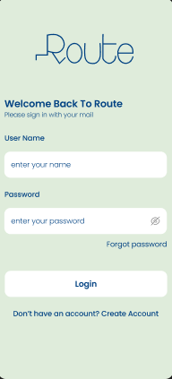
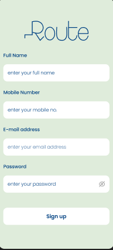
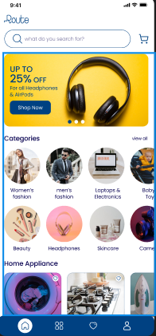
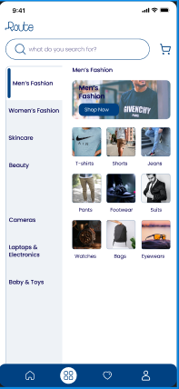
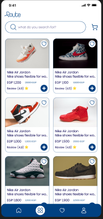
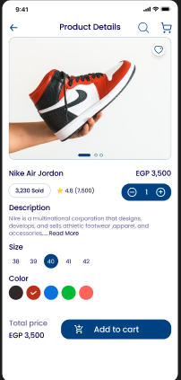
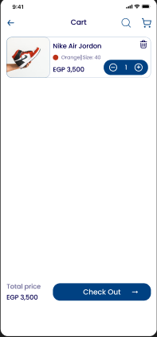
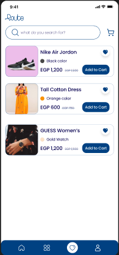
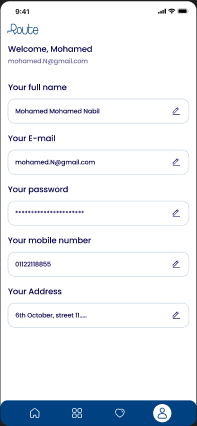

# 🛒 E-Commerce App (Flutter)

A modern Flutter E-Commerce application built with clean architecture and scalable state management for a smooth and maintainable user experience.

---

## 📱 App Screens

<p float="left">
  
  
  
  
  
  
  
  
  
  
</p>

---

## ✨ Features

- 🛍️ Product listing & details
- 🔐 User authentication
- 🛒 Shopping cart system
- ❤️ Wishlist functionality
- 🔍 Search products
- 📱 Responsive UI across devices

---

## 🏗️ Architecture & State Management

- 🧱 Clean Architecture (Separation of concerns)
  - Presentation Layer
  - Domain Layer
  - Data Layer

- ⚙️ State Management:
  - BLoC Pattern (Cubit)

This ensures:
- Scalability
- Maintainability
- Testability

---

## 🛠️ Tech Stack

- Flutter
- Dart
- BLoC (Cubit)
- Firebase (if used)
- REST APIs (if used)
- Dependency Injection (if used)

---

## 📦 Getting Started

```bash
git clone https://github.com/your-username/e_commerce.git
cd e_commerce
flutter pub get
flutter run
